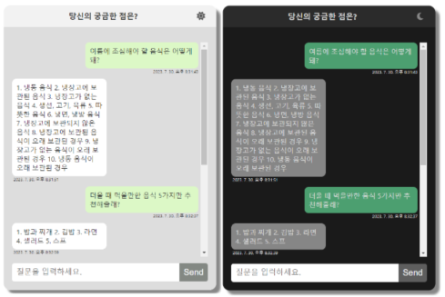
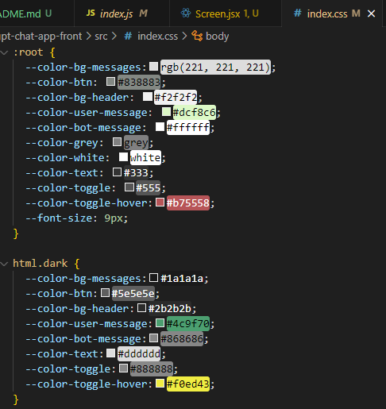
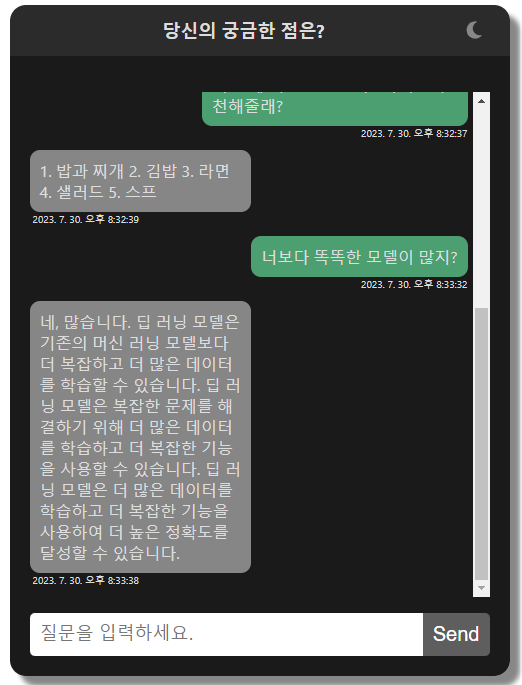
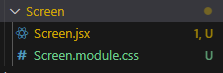
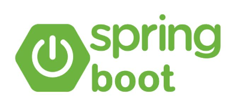
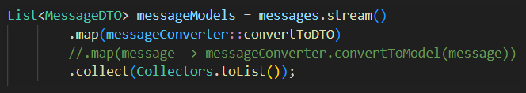
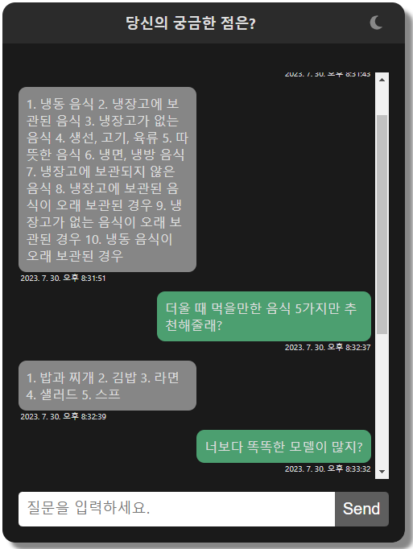
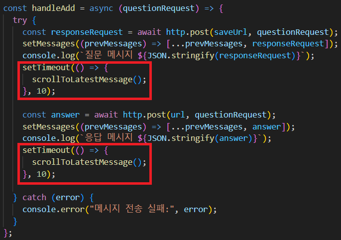

# Chat Gpt Open API를 이용한 채팅 앱

## 0. 사용한 기술

    Front-end : React.js(JS ES6), PostCSS
    Back-end : Spring Boot(Java 8)

## 1. Front-end 설명

    0) React : SPA 중 React를 사용했다. 
               사용한 이유는 React가 Vue보다 JS 공부를 더 깊게
               할 수 있어서이다.

              

    1) 다크 모드 : 다크 모드는 Context API를 사용했다.
                  :root 가상 클래스에서 사용하는 색을 변수로 관리하고 
                  다크 모드 선택 시 dark 클래스에 있는 색으로 변경하도록 구현했다. 

    2) 스크롤 기능 : 스크롤 기능은 useRef 훅을 사용했다.
                    사용한 이유는 DOM 요소에 접근하기 위함과 리랜더링 시 상태를 
                    초기화 하지 않아서 스크롤을 메시지 제일 하단에 유지시키기 
                    위함이다. 

    3) CSS : PostCSS를 사용했다. 사용한 이유는 클래스의 이름이 겹쳐도 상관 없는 것과
             하나의 컴포넌트에 어떤 CSS가 적용되었는지 관리하기 쉬워서이다.
             단점은 파일을 여러개 생성해야 한다는 점이다.

## 2. Back-end 설명

    1) Spring Boot : Spring Boot를 사용한 이유는 Tomcat이 내장되어 있어서
                     개발 환경 세팅이 편해서이다.
                     

    2) Java 8 : 업무에서는 Java7을 사용하는데, Java8의 stream이나 
                messageConverter::convertToDTO과 같이 메소드 레퍼런스가 
                코드를 간결하게 해준다는 것을 알게되었다.

## 3. 구현 중 고민했던 부분
    1) 응답 메시지가 스크롤이 안되는 문제 : handleAdd 함수에서 화면에 보이는 
                                         messages의 가장 마지막으로 스크롤이 
                                         이동하도록 구현했는데 응답 메시지로 
                                         이동 안하는 문제가 있었다.
                                         이유를 확인해보니 setMessages로 
                                         리렌더링 되기 전에 scrollToLatestMessage 함수가 실행돼서 
                                         마지막 messages로 접근을 못했던 것이었다. 
                                         scrollToLatestMessage 함수를
                                         setTimeout web api의 callback 함수로 넘겨줘서 해결했다다.

